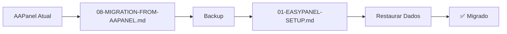
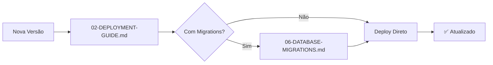
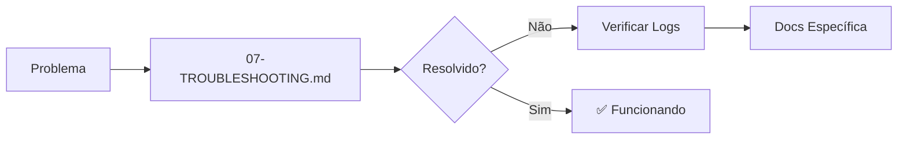

# 📚 Documentação Completa - Atendechat no Easypanel

## 🎯 Visão Geral

Esta pasta contém toda a documentação necessária para fazer deploy, configurar e gerenciar o Atendechat no **Easypanel**.

---

## 📖 Índice de Documentos

### 🚀 Início Rápido

| Documento | Tempo | Descrição |
|-----------|-------|-----------|
| [⚡ QUICKSTART](../QUICKSTART.md) | 15 min | Deploy rápido para começar imediatamente |

---

### 📘 Guias Principais

| # | Documento | Descrição | Quando Usar |
|---|-----------|-----------|-------------|
| 01 | [Easypanel Setup](./01-EASYPANEL-SETUP.md) | Guia completo de configuração inicial | Primeira instalação |
| 02 | [Deployment Guide](./02-DEPLOYMENT-GUIDE.md) | Deploy, atualizações, CI/CD e backups | Deploy e manutenção |
| 03 | [Environment Variables](./03-ENVIRONMENT-VARIABLES.md) | Todas as variáveis documentadas | Configuração de ambiente |
| 04 | [Multi-Tenant Setup](./04-MULTI-TENANT-SETUP.md) | Configurar múltiplas instâncias | Múltiplos clientes |
| 05 | [SSL & Domains](./05-SSL-DOMAINS.md) | Configuração de domínios e SSL | Setup de domínios |
| 06 | [Database Migrations](./06-DATABASE-MIGRATIONS.md) | Gerenciamento de banco de dados | Migrations e seeds |
| 07 | [Troubleshooting](./07-TROUBLESHOOTING.md) | Resolução de problemas comuns | Quando algo não funciona |
| 08 | [Migration from AAPanel](./08-MIGRATION-FROM-AAPANEL.md) | Migrar do AAPanel para Easypanel | Migração existente |

---

## 🗺️ Fluxos de Uso

### Cenário 1: Primeira Instalação

**Documentos:**
1. [QUICKSTART.md](../QUICKSTART.md) - Para começar rápido
2. [01-EASYPANEL-SETUP.md](./01-EASYPANEL-SETUP.md) - Setup completo
3. [03-ENVIRONMENT-VARIABLES.md](./03-ENVIRONMENT-VARIABLES.md) - Configurar variáveis
4. [05-SSL-DOMAINS.md](./05-SSL-DOMAINS.md) - Configurar domínios

---

### Cenário 2: Migração do AAPanel

**Documentos:**
1. [08-MIGRATION-FROM-AAPANEL.md](./08-MIGRATION-FROM-AAPANEL.md) - Guia de migração
2. [01-EASYPANEL-SETUP.md](./01-EASYPANEL-SETUP.md) - Setup no Easypanel
3. [02-DEPLOYMENT-GUIDE.md](./02-DEPLOYMENT-GUIDE.md) - Deploy e backups

---

### Cenário 3: Adicionar Novos Clientes (Multi-Tenant)

**Documentos:**
1. [04-MULTI-TENANT-SETUP.md](./04-MULTI-TENANT-SETUP.md) - Estratégias multi-tenant
2. [03-ENVIRONMENT-VARIABLES.md](./03-ENVIRONMENT-VARIABLES.md) - Variáveis por cliente
3. [05-SSL-DOMAINS.md](./05-SSL-DOMAINS.md) - Domínios customizados

---

### Cenário 4: Atualização do Sistema

**Documentos:**
1. [02-DEPLOYMENT-GUIDE.md](./02-DEPLOYMENT-GUIDE.md) - Processo de atualização
2. [06-DATABASE-MIGRATIONS.md](./06-DATABASE-MIGRATIONS.md) - Se houver migrations

---

### Cenário 5: Problema no Sistema

**Documentos:**
1. [07-TROUBLESHOOTING.md](./07-TROUBLESHOOTING.md) - Problemas comuns
2. Documentos específicos conforme o problema

---

## 📋 Resumo por Tópico

### 🔧 Configuração Inicial
- [01-EASYPANEL-SETUP.md](./01-EASYPANEL-SETUP.md)
- [03-ENVIRONMENT-VARIABLES.md](./03-ENVIRONMENT-VARIABLES.md)
- [05-SSL-DOMAINS.md](./05-SSL-DOMAINS.md)

### 🚀 Deploy e Manutenção
- [02-DEPLOYMENT-GUIDE.md](./02-DEPLOYMENT-GUIDE.md)
- [06-DATABASE-MIGRATIONS.md](./06-DATABASE-MIGRATIONS.md)

### 👥 Multi-Tenant
- [04-MULTI-TENANT-SETUP.md](./04-MULTI-TENANT-SETUP.md)

### 🔄 Migração
- [08-MIGRATION-FROM-AAPANEL.md](./08-MIGRATION-FROM-AAPANEL.md)

### 🆘 Suporte
- [07-TROUBLESHOOTING.md](./07-TROUBLESHOOTING.md)

---

## 🎓 Níveis de Experiência

### Iniciante (Primeira vez com Easypanel)

1. [⚡ QUICKSTART](../QUICKSTART.md) - 15 minutos
2. [01-EASYPANEL-SETUP.md](./01-EASYPANEL-SETUP.md) - Leia tudo
3. [07-TROUBLESHOOTING.md](./07-TROUBLESHOOTING.md) - Tenha como referência

**Dica:** Não pule etapas, siga passo a passo!

---

### Intermediário (Já usou Easypanel)

1. [⚡ QUICKSTART](../QUICKSTART.md) - Revisar rapidamente
2. [03-ENVIRONMENT-VARIABLES.md](./03-ENVIRONMENT-VARIABLES.md) - Configuração detalhada
3. [04-MULTI-TENANT-SETUP.md](./04-MULTI-TENANT-SETUP.md) - Se múltiplos clientes

**Dica:** Foque nas configurações avançadas.

---

### Avançado (DevOps/SysAdmin)

1. [02-DEPLOYMENT-GUIDE.md](./02-DEPLOYMENT-GUIDE.md) - CI/CD e automação
2. [06-DATABASE-MIGRATIONS.md](./06-DATABASE-MIGRATIONS.md) - Gestão de banco
3. [04-MULTI-TENANT-SETUP.md](./04-MULTI-TENANT-SETUP.md) - Arquitetura multi-tenant

**Dica:** Considere automações e monitoramento avançado.

---

## 🔍 Busca Rápida

### Por Problema

| Problema | Documento |
|----------|-----------|
| Sistema não inicia | [07-TROUBLESHOOTING.md](./07-TROUBLESHOOTING.md#serviço-não-inicia) |
| Erro 500 | [07-TROUBLESHOOTING.md](./07-TROUBLESHOOTING.md#erro-500) |
| Frontend não carrega | [07-TROUBLESHOOTING.md](./07-TROUBLESHOOTING.md#frontend-não-carrega) |
| SSL não funciona | [05-SSL-DOMAINS.md](./05-SSL-DOMAINS.md#troubleshooting) |
| Migrations falham | [06-DATABASE-MIGRATIONS.md](./06-DATABASE-MIGRATIONS.md#troubleshooting) |
| Banco lento | [07-TROUBLESHOOTING.md](./07-TROUBLESHOOTING.md#banco-está-lento) |

---

### Por Funcionalidade

| Funcionalidade | Documento |
|----------------|-----------|
| Configurar domínios | [05-SSL-DOMAINS.md](./05-SSL-DOMAINS.md) |
| Adicionar cliente | [04-MULTI-TENANT-SETUP.md](./04-MULTI-TENANT-SETUP.md) |
| Fazer backup | [02-DEPLOYMENT-GUIDE.md](./02-DEPLOYMENT-GUIDE.md#backups) |
| Atualizar sistema | [02-DEPLOYMENT-GUIDE.md](./02-DEPLOYMENT-GUIDE.md#atualizações-e-redeploy) |
| Executar migrations | [06-DATABASE-MIGRATIONS.md](./06-DATABASE-MIGRATIONS.md#execução-manual) |
| Configurar white label | [04-MULTI-TENANT-SETUP.md](./04-MULTI-TENANT-SETUP.md#white-label-por-cliente) |

---

## 📊 Estatísticas da Documentação

- **Total de Documentos**: 9
- **Total de Páginas**: ~150
- **Tempo de Leitura Total**: ~3 horas
- **Tempo para Setup Básico**: 15-30 minutos
- **Tempo para Setup Completo**: 1-2 horas

---

## 🆕 Atualizações

### Versão Atual: 1.0 (Janeiro 2026)

- ✅ Documentação completa criada
- ✅ 8 guias principais
- ✅ Quickstart de 15 minutos
- ✅ Troubleshooting abrangente
- ✅ Guia de migração do AAPanel

---

## 💡 Dicas de Uso

### Primeira Vez?
👉 Comece com [QUICKSTART.md](../QUICKSTART.md)

### Migrando do AAPanel?
👉 Leia [08-MIGRATION-FROM-AAPANEL.md](./08-MIGRATION-FROM-AAPANEL.md)

### Problema no Sistema?
👉 Consulte [07-TROUBLESHOOTING.md](./07-TROUBLESHOOTING.md)

### Configuração Avançada?
👉 Veja [03-ENVIRONMENT-VARIABLES.md](./03-ENVIRONMENT-VARIABLES.md)

---

## 📞 Suporte

### Ordem de Resolução:

1. **Troubleshooting**: [07-TROUBLESHOOTING.md](./07-TROUBLESHOOTING.md)
2. **Documentação Específica**: Consulte o guia relacionado
3. **Easypanel Docs**: [docs.easypanel.io](https://docs.easypanel.io)
4. **Issues GitHub**: Crie um issue com logs e detalhes

---

## ✅ Checklist Geral

### Antes do Deploy
- [ ] Ler [QUICKSTART.md](../QUICKSTART.md)
- [ ] Servidor Easypanel configurado
- [ ] Domínios apontando corretamente
- [ ] Credenciais geradas (senhas, JWT secrets)

### Durante o Deploy
- [ ] Seguir [01-EASYPANEL-SETUP.md](./01-EASYPANEL-SETUP.md)
- [ ] Configurar variáveis ([03-ENVIRONMENT-VARIABLES.md](./03-ENVIRONMENT-VARIABLES.md))
- [ ] Configurar SSL ([05-SSL-DOMAINS.md](./05-SSL-DOMAINS.md))

### Após o Deploy
- [ ] Testar todos os serviços
- [ ] Alterar senha padrão
- [ ] Configurar backups ([02-DEPLOYMENT-GUIDE.md](./02-DEPLOYMENT-GUIDE.md#backups))
- [ ] Configurar monitoramento

---

## 🎯 Objetivo da Documentação

Esta documentação foi criada para:

✅ **Eliminar** a necessidade do instalador AAPanel  
✅ **Simplificar** o processo de deploy  
✅ **Automatizar** configurações complexas  
✅ **Documentar** todas as funcionalidades  
✅ **Facilitar** troubleshooting  
✅ **Permitir** escalabilidade fácil  

---

## 🤝 Contribuindo

Para melhorar a documentação:

1. Fork o repositório
2. Faça suas alterações nos arquivos `.md`
3. Teste as instruções
4. Abra um Pull Request

---

## 📝 Convenções

- **Emojis**: Usados para facilitar navegação visual
- **Código**: Sempre com syntax highlighting
- **Avisos**: ⚠️ para alertas importantes
- **Sucesso**: ✅ para confirmações
- **Comandos**: Sempre em blocos de código

---

**📚 Documentação completa, clara e prática!**

**🚀 Deploy fácil, gestão simples, resultados incríveis!**

---

*Última atualização: Janeiro 2026*  
*Versão: 1.0*  
*Atendechat Team*
